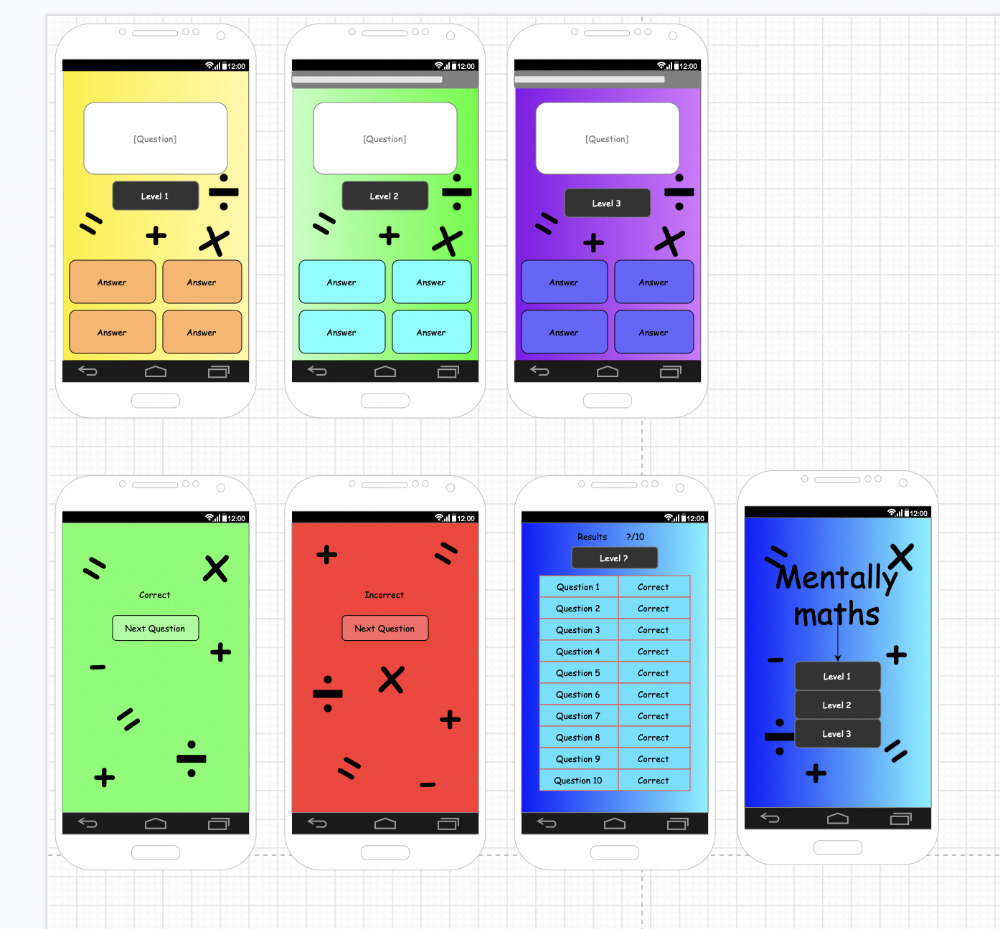

# Maths App

This project is an app that i am developing for my college app development unit. The game is an app that is for a young target audience, with the purpose of improving their mental maths.

The apps has a menu that will let the user decide what difficulty level they want to play on. The first level will be without a timer, the second level will have a timer for each question of 20 seconds, and the third will have a 10 second time limit for each question.

## Design of the app 

